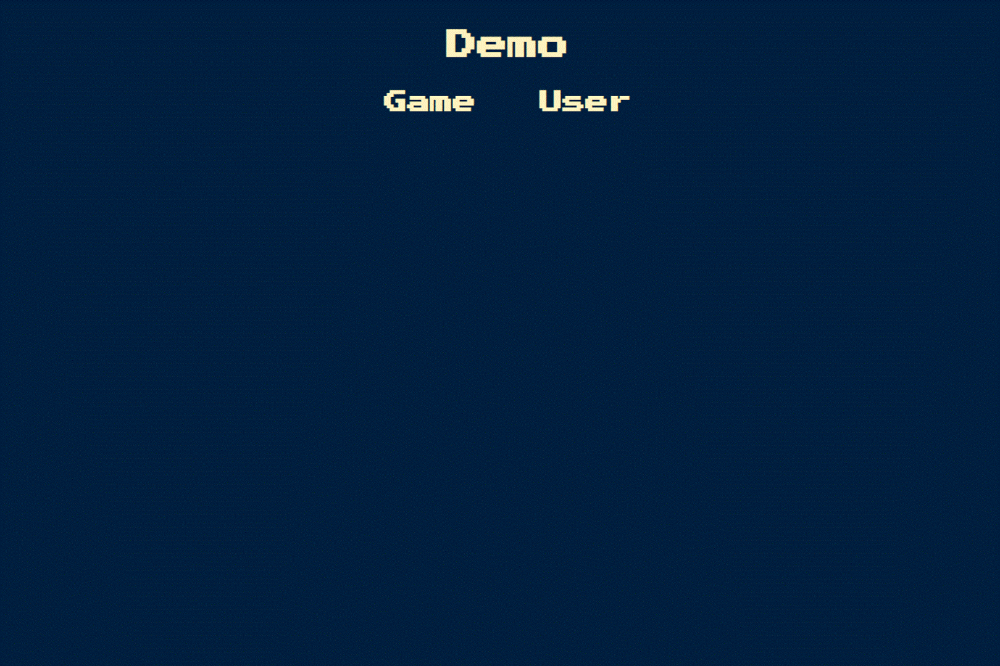

# About
[Simon](https://en.wikipedia.org/wiki/Simon_(game) is a memory skill game where the player must correctly select the same color sequence as the computer.

The computer will continue to randomly choose a color until the player can no longer correctly select the computer chosen color pattern.

[Play now!](https://victoria-soto.github.io/SimonGame/)

## Demo
If you're not familiar with the basic game play concept, refer to the demo below.

 
